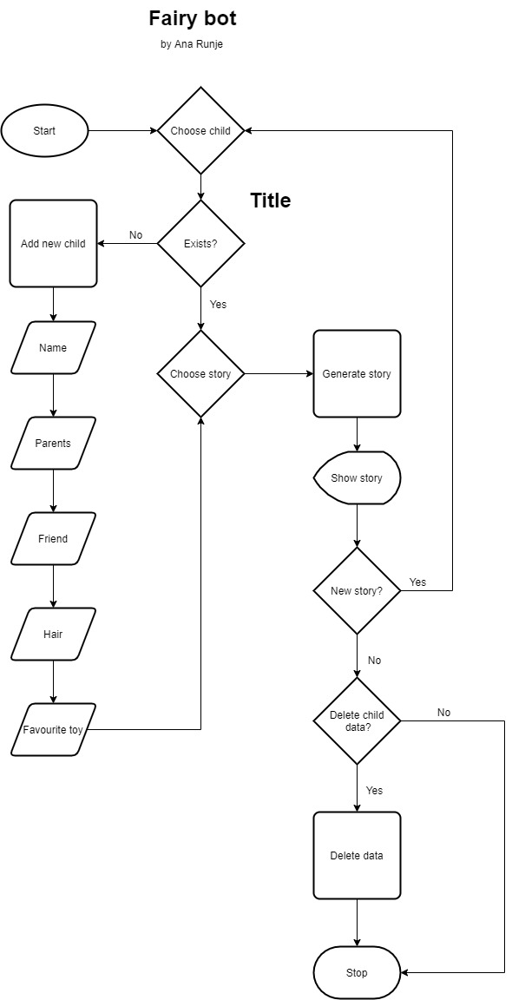

# Fairy Bot
(Developer: Ana Runje)

[Live webpage](https://pp3-fairy-bot.herokuapp.com/)

## Table of Content

1. [Project Goals](#project-goals)
    1. [User Goals](#user-goals)
    2. [Site Owner Goals](#site-owner-goals)
2. [User Experience](#user-experience)
    1. [Target Audience](#target-audience)
    2. [User Requirements and Expectations](#user-requirements-and-expectations)
    3. [User Stories](#user-stories)
    4. [Site Owner Stories](#site-owner-stories)
3. [Technical Design](#technical-design)
    1. [Flowchart](#flowchart)
4. [Technologies Used](#technologies-used)
    1. [Languages](#languages)
    2. [Frameworks & Tools](#frameworks-&-tools)
5. [Features](#features)
6. [Testing](#validation)
    1. [PEP8 validation](#pep8-validation)
    2. [Testing user stories](#testing-user-stories)
8. [Bugs](#Bugs)
9. [Deployment](#deployment)
    1. [EmailJS API](#emailjs-api)
10. [Credits](#credits)
11. [Acknowledgments](#acknowledgments)

## Project Goals 
Fairy Bot is an app that outputs a faritytale that has been personalized to the terminal.

### User Goals
- Get personalized fairy tales for the users child

### Site Owner Goals
- Providing users with the option to pick different farity tales that are personalized for their child

## User Experience

### Target Audience
- Parents who want to read personalized stories to their children at bed time
- Children who would like to read personalized stories themselves
- Childminders who want to be able to personalize stories for many children

### User Requirements and Expectations
- Easy set up
- Ability to add and delete data
- Easy to use

### User Stories
1. As a user, I want to be able to add info about my child
2. As a user, I want an option to add multiple children
3. As a user, I want to pick from a list of stories
4. As a user, I want to be able to delete info about my child

### Site Owner Stories
5. As a site owner, I want the user to get feedback in case of wrong input
6. As a site owner, I want the user to be able to run the app again and again

## Technical Design

### Flowchart

Flowchart

## Technologies Used

### Languages
- Python 3

### Frameworks & Tools
- diagrams.net - to create a flow chart

## Features

## Validation

### PEP8 validation

### Testing user stories

1. As a user, I want to be able to pick a difficulty for the game

| **Feature** | **Action** | **Expected Result** | **Actual Result** |
|-------------|------------|---------------------|-------------------|

Screenshots

## Bugs

| **Bug** | **Fix** |
| ----------- | ----------- |

## Deployment
The website was deployed using Heroku by following these steps:
1. 

You can fork the repository by following these steps:
1. Go to the GitHub repository
2. Click on Fork button in the upper right hand corner

You can clone the repository by following these steps:
1. Go to the GitHub repository 
2. Locate the Code button above the list of files and click it 
3. Select if you prefer to clone using HTTPS, SSH, or Github CLI and click the copy button to copy the URL to your clipboard
4. Open Git Bash
5. Change the current working directory to the one where you want the cloned directory
6. Type git clone and paste the URL from the clipboard ($ git clone https://github.com/YOUR-USERNAME/YOUR-REPOSITORY)
7.Press Enter to create your local clone.

## Credits
- The app was inspired by Storpie - Bedtime stories and lullabies for kids by Zia produkcija d.o.o. android app
- The stories within the app were modified from the book "365 Stories and Rhymes" by various authors.

### Media
- ASCII art book was taken from https://www.asciiart.eu/books/books
- The Icon at the top of the page made by <a href="https://www.flaticon.com/authors/phatplus" title="phatplus">phatplus</a> from <a href="https://www.flaticon.com/" title="Flaticon">www.flaticon.com</a>

### Code
- code for appending rows to a csv file was modified from the following example: https://stackoverflow.com/a/37654233
- code for generating a unique user id was taken from here: https://github.com/skorokithakis/shortuuid
- code to replace the placeholders in the .txt files with values from a dictionary was taken from here: https://stackoverflow.com/a/30646873

## Acknowledgments
I would like to take the opportunity to thank:
- My mentor Mo Shami for his feedback, advice, guidance and support.
- My husband Jure Runje for his support, advice, help with testing, and for giving me some kids free time to work on my project.