# Fairy Bot
(Developer: Ana Runje)

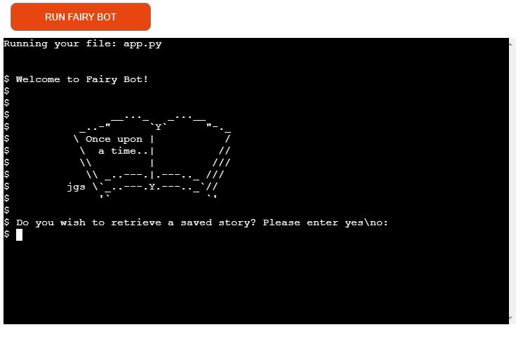

[Live webpage](https://pp3-fairy-bot.herokuapp.com/)

## Table of Content

1. [Project Goals](#project-goals)
    1. [User Goals](#user-goals)
    2. [Site Owner Goals](#site-owner-goals)
2. [User Experience](#user-experience)
    1. [Target Audience](#target-audience)
    2. [User Requirements and Expectations](#user-requirements-and-expectations)
    3. [User Stories](#user-stories)
    4. [Site Owner Stories](#site-owner-stories)
3. [Technical Design](#technical-design)
    1. [Flowchart](#flowchart)
4. [Technologies Used](#technologies-used)
    1. [Languages](#languages)
    2. [Frameworks & Tools](#frameworks-&-tools)
5. [Features](#features)
6. [Testing](#validation)
    1. [PEP8 validation](#pep8-validation)
    2. [Testing user stories](#testing-user-stories)
8. [Bugs](#Bugs)
9. [Deployment](#deployment)
    1. [EmailJS API](#emailjs-api)
10. [Credits](#credits)
11. [Acknowledgments](#acknowledgments)

## Project Goals 
Fairy Bot is an app that outputs a faritytale that has been personalized to the terminal.

### User Goals
- Get personalized fairy tales for the users child

### Site Owner Goals
- Providing users with the option to pick different farity tales that are personalized for their child

## User Experience

### Target Audience
- Parents who want to read personalized stories to their children at bed time
- Children who would like to read personalized stories themselves
- Childminders who want to be able to personalize stories for many children

### User Requirements and Expectations
- Easy set up
- Ability to add and delete data
- Easy to use

### User Stories
1. As a user, I want to be able to add info about my child
2. As a user, I want an option to add multiple children
3. As a user, I want to pick from a list of stories
4. As a user, I want to be able to delete info about my child
5. As a user, I want to be able to save a story for later
6. As a user, I want to be able to read a saved story

### Site Owner Stories
7. As a site owner, I want the user to get feedback in case of wrong input
8. As a site owner, I want the user to be able to read multiple stories
9. As a site owner, I want only the user who saved the story to be able to read the same. 

## Technical Design

### Flowchart

Flowchart

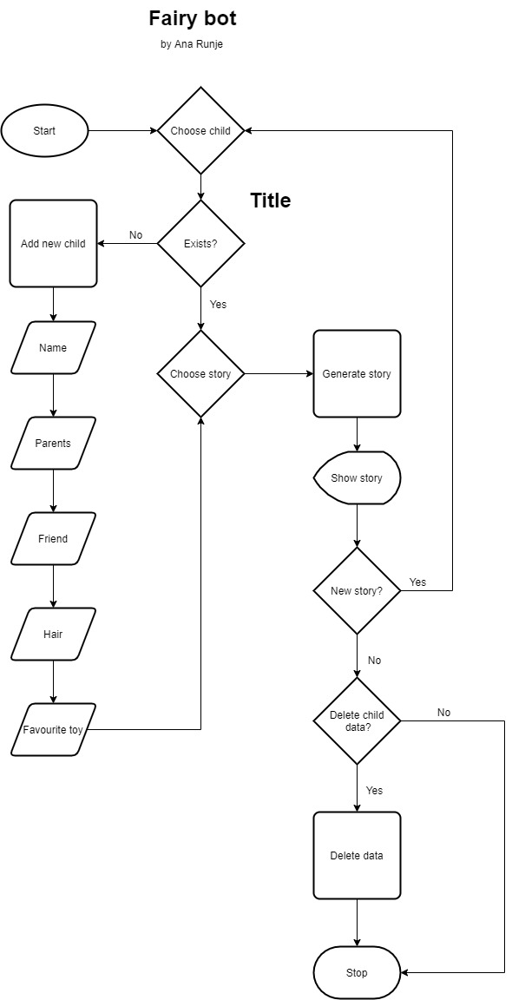

## Technologies Used

### Languages
- Python 3

### Frameworks & Tools
- diagrams.net - to create a flow chart
- gitHub
- Gitpod
- Git

## Features

### Welcome Message
- Shows a welcome message and an ASCII art containing an open book

Welcome message

### Retrieve Saved Story
- Offers an option to choose if you want to display a saved story
- Propmpts for user id if the option is chosen and displays the relevant story
- User stories covered: 6, 9

Retrieve saved story

### Choose Child
- Offers the user a list of children to choose from
- Has the option to add a new child to the list
- Two children have been predefined as examples

Choose child

### Add Child
- The option for adding a user defined child to the list of children
- Features questions about the child to help personalize the story
- User stories covered: 1, 2

Add child

Add child 2

### Choose Story
- Based on the sex of the child chosen previously lists the available stories and asks the user to choose one
- User stories covered: 3

Choose story

### Custom Story
- A story customized with the information provided for the child

Custom story

### Save Story
- An option to save the story
- If chosen, the story is saved to a .csv file and the user is given a unique user id for later access of the story
- User stories covered: 5, 9

Save story

### New Story Option
- An option to display another story
- Returns to the choose child feature if a new story is required
- User stories covered: 8

New story option

### Delete Child
- An option to delete a child
- If the option is chosen, a list of children to choose from
- The chosen child is deleted
- User stories covered: 4

Delete child

### Thank You Message
- Displays a thank you message and instructions on how to restart the game

Thank you message

### User Input Validation
- Displays an error message if user input is not in a form that was expected
- Ask for a new input
- User stories covered: 7

User input validation

## Validation

### PEP8 validation
PEP8 online was used to check the code for PEP8 requirements.
All the code passes with no errors and no warnings to show.

app.py

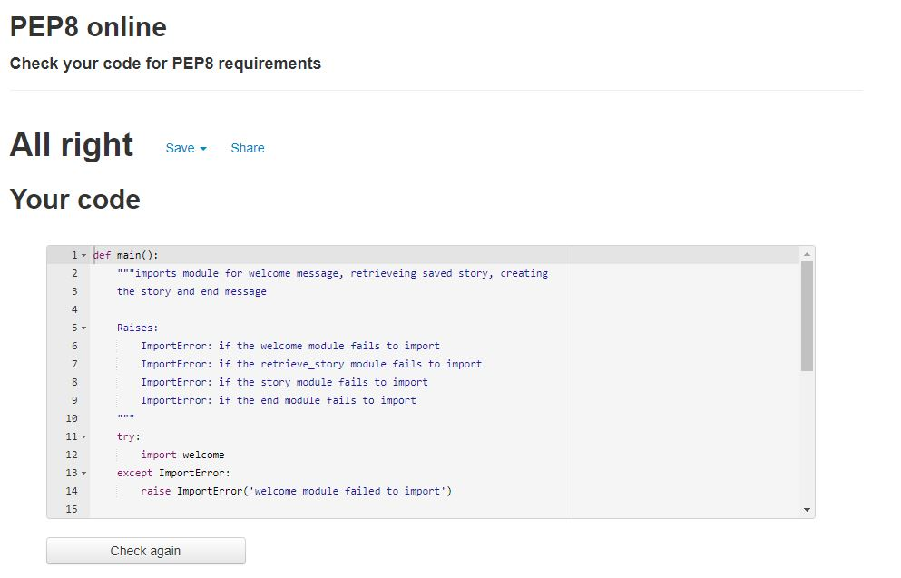

child_info.py

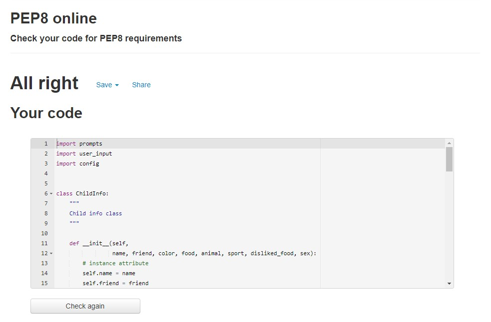

config.py

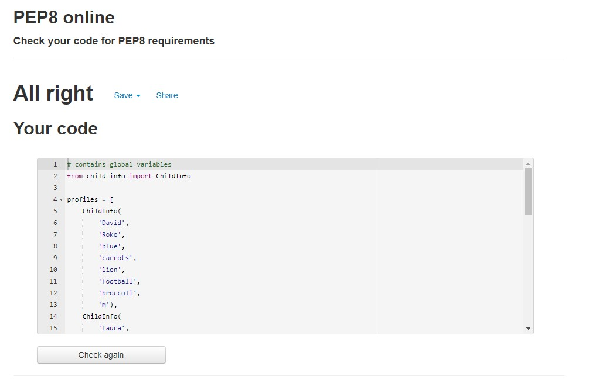

end.py

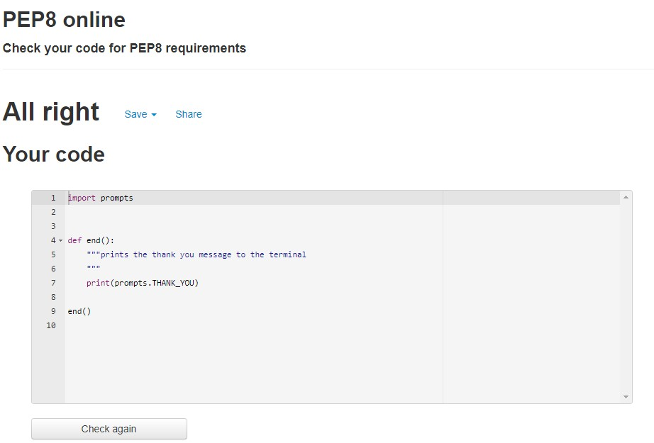

prompts.py

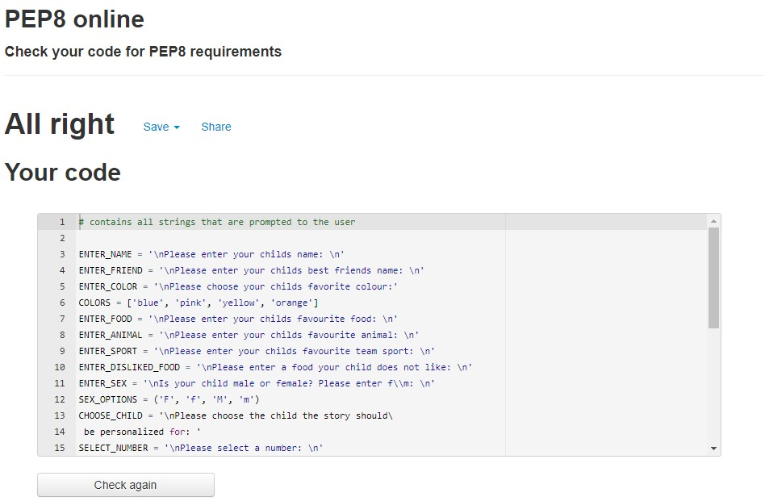

retrieve_story.py

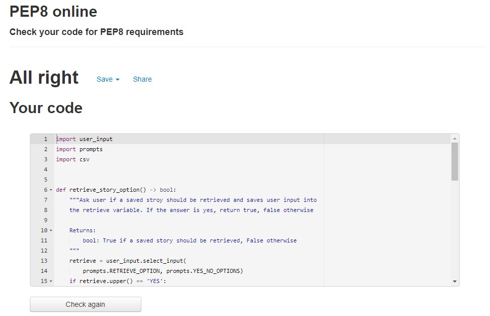

save_story.py

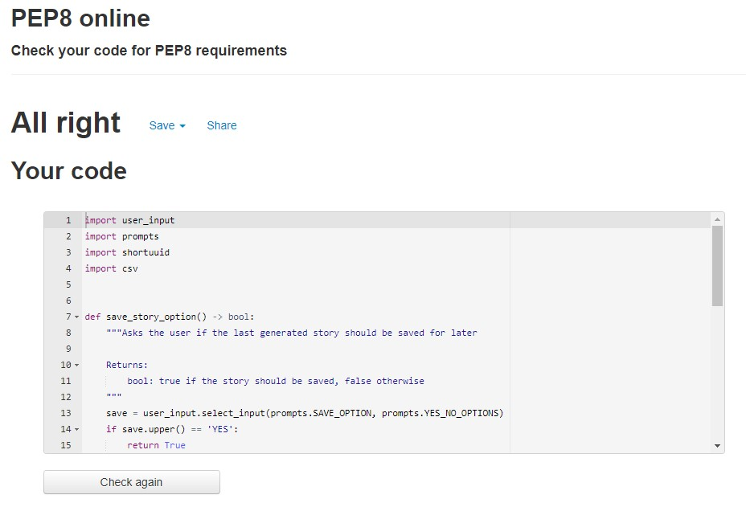

user_input.py

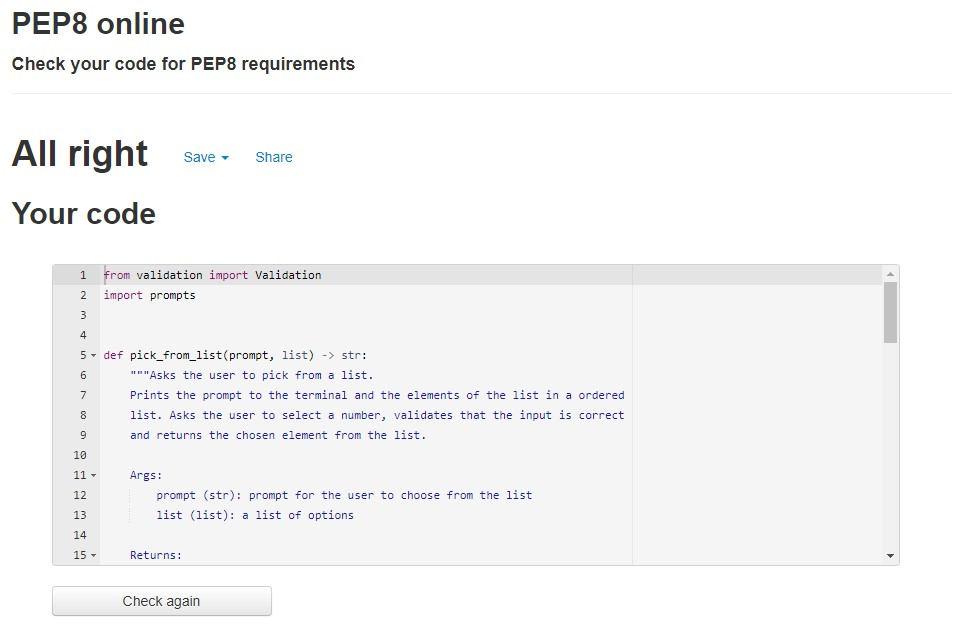

validation.py

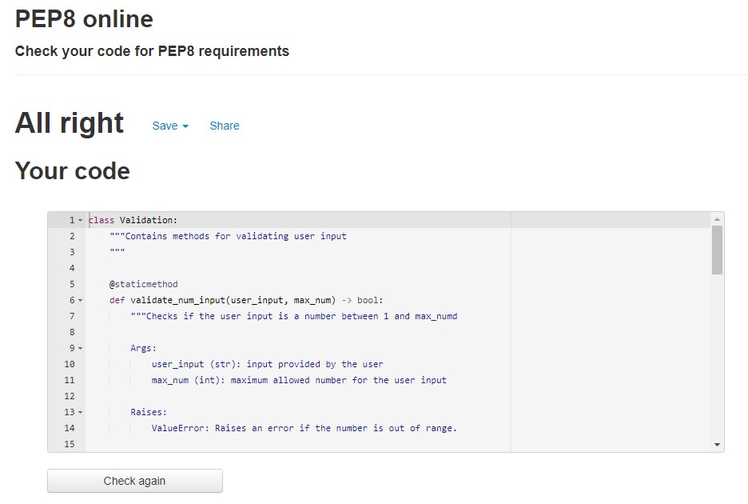

welcome.py

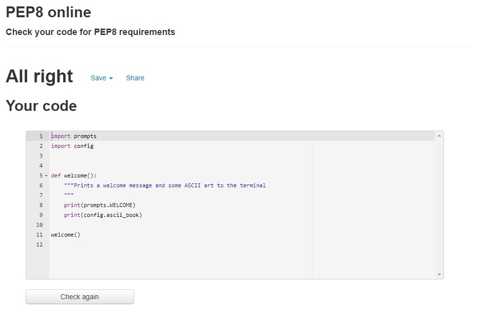

### Testing user stories

1. As a user, I want to be able to pick a difficulty for the game

| **Feature** | **Action** | **Expected Result** | **Actual Result** |
|-------------|------------|---------------------|-------------------|

Screenshots

## Bugs

| **Bug** | **Fix** |
| ----------- | ----------- |

## Deployment
The website was deployed using Heroku by "following these steps:
1. Use the "pip freeze -> requiremnts.txt" comand in the terminal to save any libraries that need to be instaled in the file
2. Log in or create a Heroku account
3. Click the "new" button in the upper right corner and select "create new app"
4. Choose an app name and your region and click "Create app"
5. Go to the "settings" tab, add the python build pack and then the node.js build pack
6. Go to the "deploy" tab and pick gitHub as a deployment method
7. Search for a repository to connect to
8. Click enable automatic deploys and then deploy branch
9. Wait for the app to build and then click on the "View" link

You can fork the repository by following these steps:
1. Go to the GitHub repository
2. Click on Fork button in the upper right hand corner

You can clone the repository by following these steps:
1. Go to the GitHub repository 
2. Locate the Code button above the list of files and click it 
3. Select if you prefer to clone using HTTPS, SSH, or Github CLI and click the copy button to copy the URL to your clipboard
4. Open Git Bash
5. Change the current working directory to the one where you want the cloned directory
6. Type git clone and paste the URL from the clipboard ($ git clone https://github.com/YOUR-USERNAME/YOUR-REPOSITORY)
7. Press Enter to create your local clone.

## Credits
- The app was inspired by Storpie - Bedtime stories and lullabies for kids by Zia produkcija d.o.o. android app
- The stories within the app were modified from the book "365 Stories and Rhymes" by various authors.

### Media
- ASCII art book was taken from https://www.asciiart.eu/books/books

### Code
- code for appending rows to a csv file was modified from the following example: https://stackoverflow.com/a/37654233
- code for generating a unique user id was taken from here: https://github.com/skorokithakis/shortuuid
- code to replace the placeholders in the .txt files with values from a dictionary was taken from here: https://stackoverflow.com/a/30646873

## Acknowledgments
I would like to take the opportunity to thank:
- My mentor Mo Shami for his feedback, advice, guidance and support.
- My husband Jure Runje for his support, advice, help with testing, and for giving me some kids free time to work on my project.